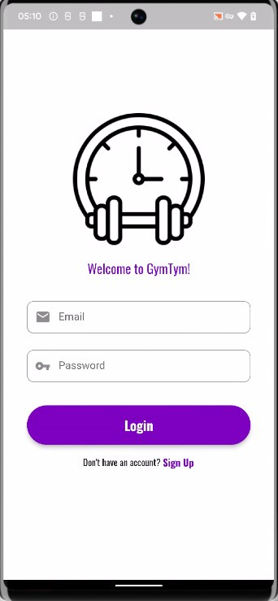
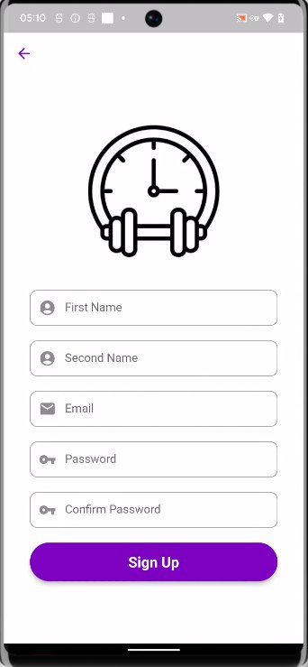
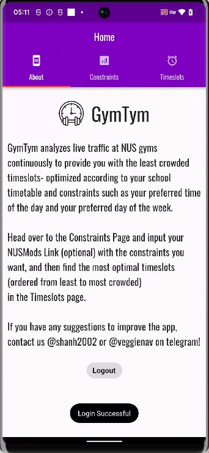
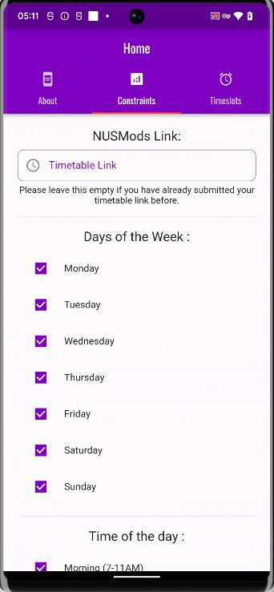
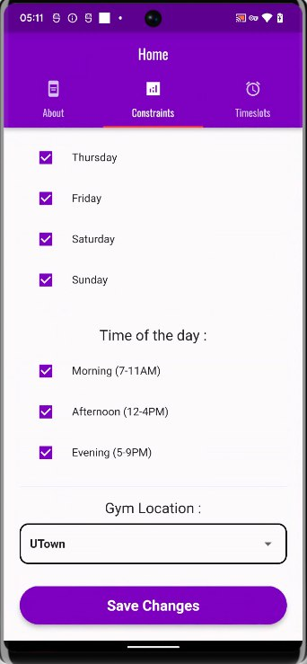

# GymTym

A new Flutter project

## Motivation

NUS gyms can often get crowded, making waiting time for machine usage extremely long. Given that this is a personal pain-point felt by us, we decided to analyze gym traffic consistently to tell the user when, according to his timetable, would be the best slot to use the gym. Understanding that different users have different day and time preferences, we have also added constraints that allow the user to indicate the same.

## Description
GymTym is an Android mobile application for the gym users of NUS to find the least crowded time slot to go the 3 on campus gyms (Utown/MPSH/USC). The app allows users to create an account, following which the user can input his NUSMods timetable link, and select constraints such as the preferred days of the week, time of the day and gym location. The app then suggests a few time slots to the user, in order of least crowded to most crowded.

## Screenshots

|  |  |  |
|:---:|:---:|:---:|
| *Login Page* | *SignUp Page* | *Home Page* |

|  |  |
|:---:|:---:|
|  |  |


## How it works

We have set up a web scraper that periodically scrapes live crowd data (at regular 20 minute intervals) from the NUS REBOKS website. This crowd data is stored in a database, along the user timetable and constraints. This way, everytime a user logs in to the app, the app can suggest best timeslots taking into account average gym crowd at the time.

## Demo

Click [here](bit.ly/gymtym-demo) to view the video demo of GymTym.

## Testing

The APK build of the app can be downloaded [here](https://drive.google.com/file/d/1l4tAGBzcUtE7sdzbaBOgo6WBOcA-jWET/view).(only for Android Users) 

The app can also be tested using an Android Virtual Device (AVD) on Windows using the same APK. For this : 
1. Create and run an AVD using Android Studio’s Virtual Device Manager
2. Now, run the following commands on CLI
```
git clone https://github.com/sh4nH/GymTym-Frontend
cd GymTym-Frontend
flutter run
```
3. If required select the AVD from the list, else it will automatically run on the emulator.

